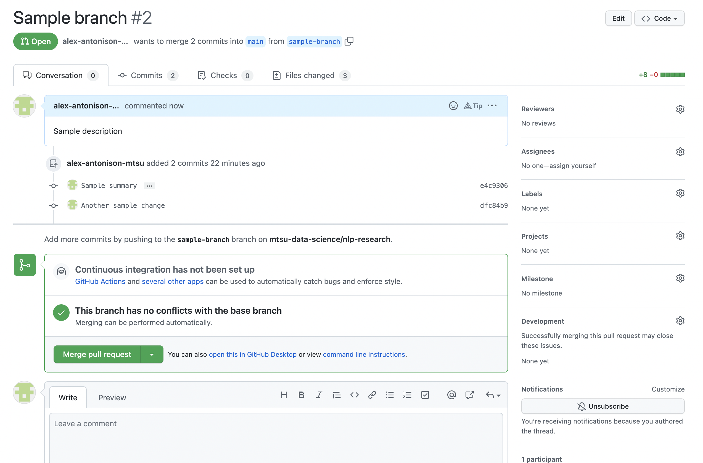

# GitHub Onboarding

## Overview

This project is going to be using GitHub for supporting collaboration for the project.  To submit work to the project, you will need to clone the repository to your local computer and create a branch.

## Steps

1. Download GitHub Desktop from [GitHub Desktop Download](https://desktop.github.com/).
2. Open GitHub Desktop and sign into your GitHub account associated with the project.
3. Configure your git
   1. 
4. Once installed and configured, you can clone your first repository!  You will want to look for `mtsu-data-science/non-profit-categorization`
   1. 
5. The next prompt will be where to clone the repository, this will be important to keep in mind since this is where you will be working out of.
   1. 
6. Once set up, you will then be in the main GitHub Window.
   1. 
7. To start on work, the first step will be to create a branch off of `main`.  You will do this by selecting the `Current Branch` drop down and type in the new branch name.  More descriptive branch names make it easier to find.
   1. 
8. Once a branch has been created, you can then start work!
9. As you add files or make changes to existing files, you will see file changes pop up in the side.
   1.  
10. When you are ready to commit your work, you can enter in a brief summary and description for the changes to commit and then select `Commit to {branch-name}`
    1.  
11. When ready, you can then push your branch up to GitHub by selecting `Publish branch`
    1.  
12. When you are ready for your work to be reviewed, you can then create a Pull Request.  You will go to [GitHub Pull Request](https://github.com/mtsu-data-science/nlp-research/pulls). Once there, you will select `New pull request`
    1.  
13. Select the branch for the Pull Request and then select `Create pull request`
    1.  
    2.  
14. Fill out the pull request and select who you would like to review the Pull Request.  It is also a good idea to post the Slack so people are aware your work is ready for review.
    1.  
15. Congratulations! You you have no created your first Pull Request
    1.  
